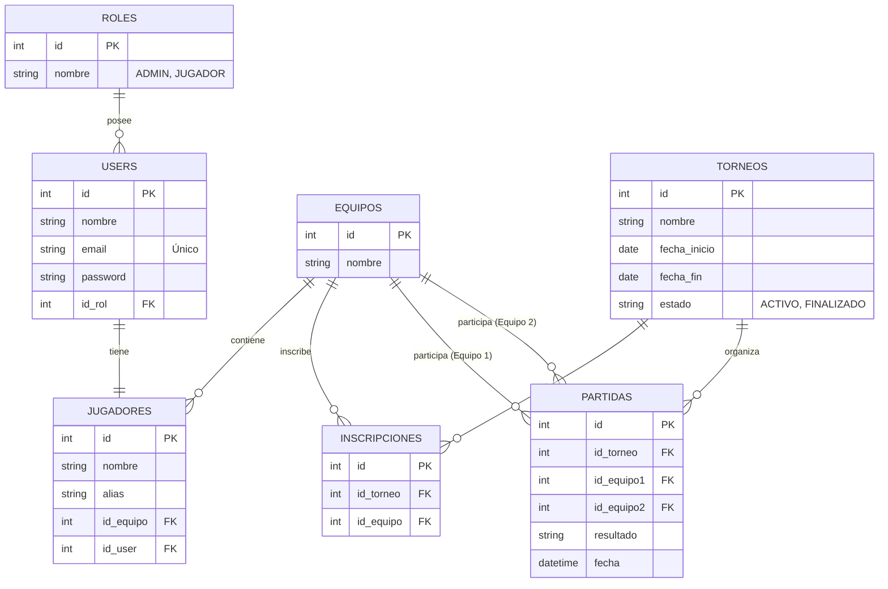

# Sistema de Gestión de Torneos de Videojuegos

Este proyecto es una aplicación de escritorio desarrollada en Java utilizando **Swing** para la interfaz gráfica y **SQL Server** como motor de base de datos. Permite la administración y consulta de torneos, equipos, jugadores y usuarios, gestionando accesos y permisos mediante un sistema de inicio de sesión con roles diferenciados.

---

## 📋 Requerimientos del Sistema

### 1. Requerimientos Funcionales (RF)

#### **RF-01: Control de Acceso (Autenticación y Seguridad)**
* El sistema debe contar con una pantalla de inicio de sesión para restringir el acceso a usuarios no autorizados.
* Debe validar las credenciales de correo electrónico y contraseña contra los registros de la base de datos.
* Al iniciar sesión, el sistema debe redirigir al usuario a su panel correspondiente según su rol asignado (`ADMIN` o `JUGADOR`).

#### **RF-02: Gestión de Roles**
* El sistema debe soportar dos roles con distintos niveles de privilegio:
  * **ADMIN (Administrador):** Acceso total para gestionar todos los módulos del sistema (CRUD completo).
  * **JUGADOR (Jugador):** Acceso limitado a la consulta de información de torneos, clasificaciones y sus propias partidas.

#### **RF-03: Módulo de Gestión de Torneos (Solo Administrador)**
* El administrador debe poder crear nuevos torneos especificando:
  * Nombre del torneo.
  * Fecha de inicio.
  * Fecha de finalización.
  * Estado inicial (por defecto `ACTIVO`).
* Debe permitir visualizar, editar y eliminar registros de torneos existentes.
* El estado del torneo debe restringirse únicamente a los valores `ACTIVO` o `FINALIZADO`.

#### **RF-04: Módulo de Gestión de Equipos (Solo Administrador)**
* Permitir el registro, visualización, modificación y eliminación (CRUD) de equipos de videojuegos, identificados por un nombre único.

#### **RF-05: Módulo de Gestión de Jugadores (Solo Administrador)**
* Registrar jugadores con los siguientes datos:
  * Nombre completo.
  * Alias (nombre de usuario / gamertag).
  * Equipo al que pertenece (relación obligatoria con la tabla de Equipos).
  * Usuario del sistema asociado (relación obligatoria con la tabla de Usuarios).
* Permitir la edición y eliminación de jugadores existentes.

#### **RF-06: Módulo de Gestión de Usuarios (Solo Administrador)**
* Permitir la administración de cuentas de usuario que acceden al sistema.
* Los datos obligatorios incluyen: Nombre, Correo Electrónico (único), Contraseña y Rol asignado.

#### **RF-07: Módulo del Jugador (Consultas y Vistas)**
* El jugador autenticado debe poder visualizar un menú que facilite el acceso futuro a:
  * Torneos disponibles.
  * Sus partidas programadas.
  * Clasificaciones del torneo (Leaderboards).
  *(Actualmente estas vistas se encuentran en desarrollo como prototipos).*

---

### 2. Requerimientos No Funcionales (RNF)

* **Interfaz de Usuario (UI):** Diseñada en Java Swing con una paleta de colores limpia y moderna (enfoque blanco/azul y botones de Windows forzados para consistencia visual).
* **Persistencia de Datos:** Uso de base de datos relacional en Microsoft SQL Server.
* **Seguridad de Conexión:** Conexión mediante JDBC utilizando **Windows Integrated Security** (Autenticación integrada de Windows), encriptación y confianza automática del certificado del servidor.
* **Control de Errores e Integridad:**
  * No se permite inscribir un equipo más de una vez en el mismo torneo.
  * En una partida, el equipo 1 y el equipo 2 deben ser obligatoriamente diferentes.
* **Pruebas de Calidad:** Implementación de pruebas unitarias exhaustivas con JUnit para comprobar el correcto funcionamiento de la capa de persistencia (DAOs).

---

## 🗄️ Arquitectura y Modelo de Datos

La base de datos del proyecto (`torneos_db`) está estructurada bajo la siguiente arquitectura de tablas:



---

## ⚙️ Configuración y Ejecución del Proyecto

### Requisitos Previos
1. **Java JDK 17** (o superior).
2. **Microsoft SQL Server** instalado y corriendo localmente.
3. Cuenta de Windows con permisos de acceso al servidor de base de datos para la autenticación integrada.

### Paso 1: Configurar la Base de Datos
Ejecuta el script SQL ubicado en `sql/script_base_datos.sql` en tu instancia de SQL Server. Este script:
* Crea la base de datos `torneos_db`.
* Genera las tablas con sus llaves foráneas y restricciones.
* Inserta datos iniciales de prueba (roles, equipos, un torneo de muestra y el usuario administrador por defecto).

### Paso 2: Ejecutar la Aplicación
1. Compila el proyecto con tu herramienta de compilación preferida (Maven).
2. Abre una terminal en la raíz del proyecto y ejecuta el archivo por lotes provisto:
   ```cmd
   run_app.bat
   ```
   *(El script cargará el classpath desde `classpath.txt` y arrancará la clase principal `Main`).*

---

## 📂 Estructura del Proyecto

* **`com.torneos.dominio`**: Clases de dominio y modelos de negocio (`Torneo`, `Equipo`, `Jugador`, `User`, `Rol`, `Partida`, `Inscripcion`).
* **`com.torneos.persistencia`**: Capa DAO (Data Access Object) para interactuar con la base de datos SQL Server.
* **`com.torneos.vistas`**: Ventanas e interfaces gráficas desarrolladas con Java Swing.
* **`com.torneos.utils`**: Clases utilitarias como `Conexion` para administrar el ciclo de vida de la conexión JDBC (Patrón Singleton).
